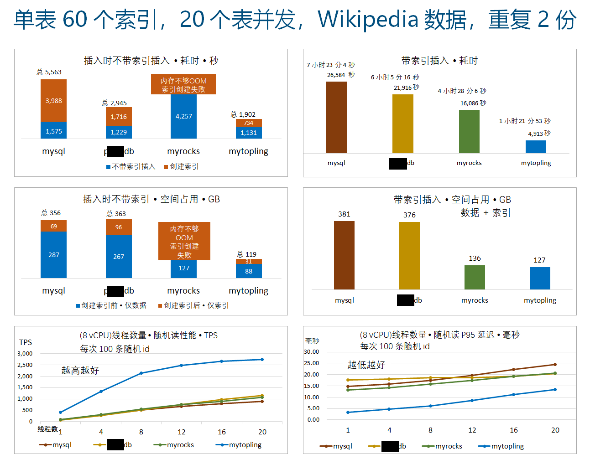
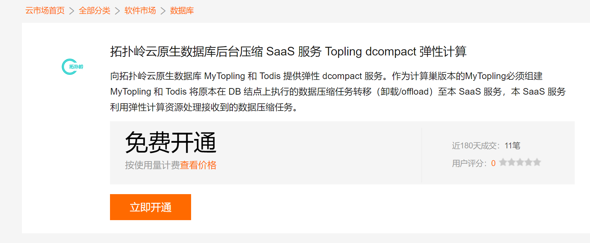
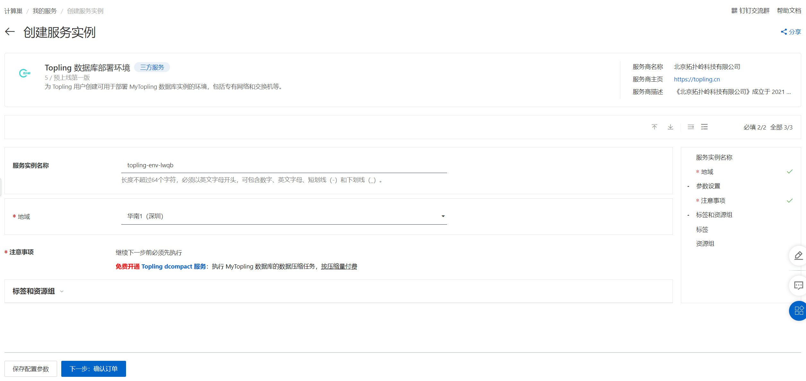
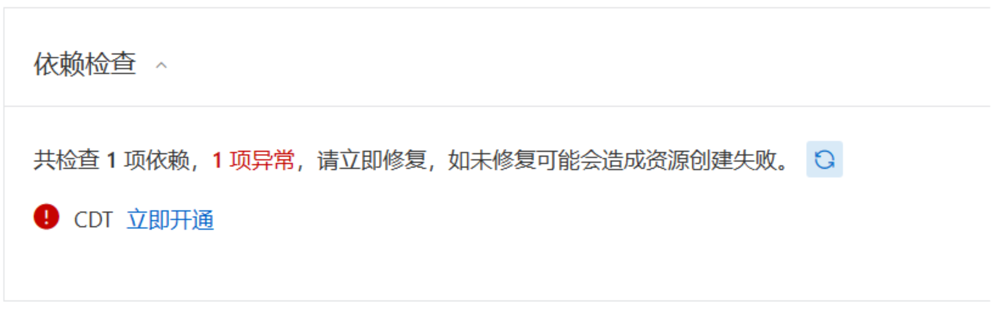
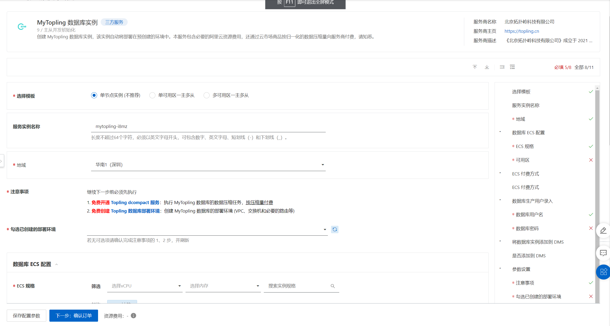
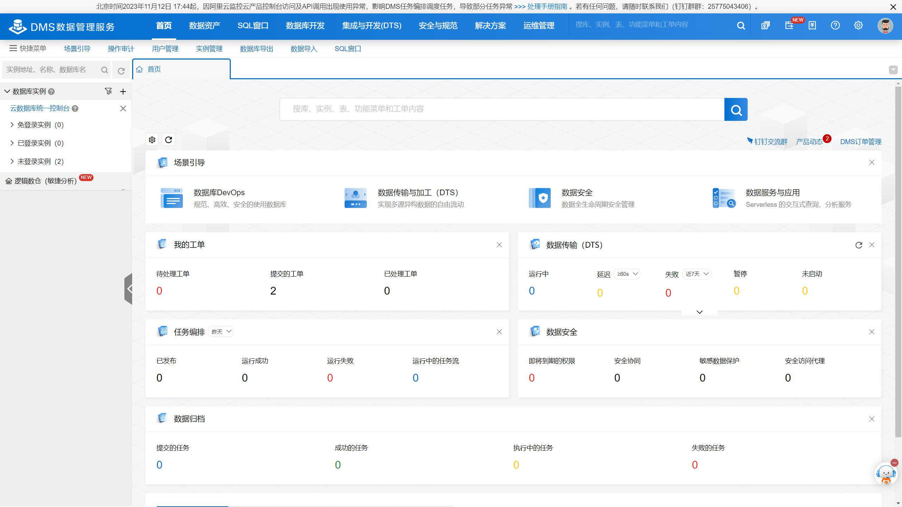
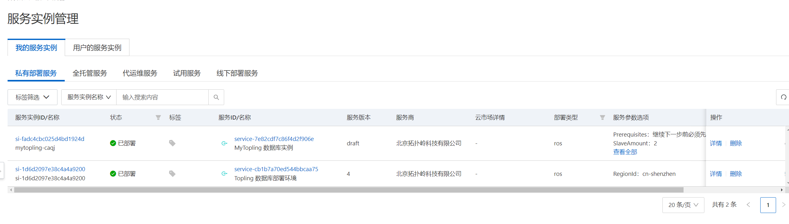
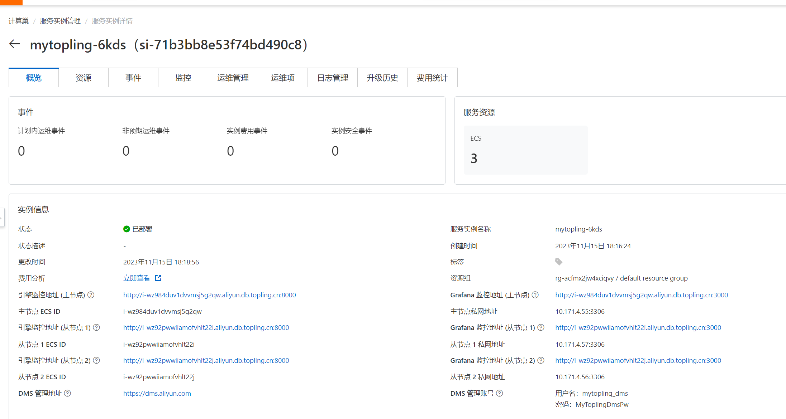

# 服务使用说明

## 产品说明
ToplingDB SaaS 系列数据库(如 MyTopling)由以下三部分组成:
* [Topling SaaS 弹性计算服务](https://market.aliyun.com/products/56024006/cmgj00064106.html) 执行代理运算。在数据库运行的过程中，Topling SaaS 弹性计算服务会按照使用运算量收取费用。

* [Topling 数据库运行环境](https://computenest.console.aliyun.com/service/instance/create/cn-hangzhou?type=user&ServiceId=service-cb1b7a70ed544bbcaa75)
为后续创建 MyTopling 等数据库创建运行环境。包含VPC、vSwitch以及连接到 Topling SaaS 弹性计算服务的对等连接。ToplingDB 系列数据库必须部署在对应地域(Region)的运行环境下。

* [MyTopling 数据库](https://computenest.console.aliyun.com/service/instance/create/cn-hangzhou?type=user&ServiceId=service-7e82cdf7c86f4d2f906e)
用户实际使用的数据库。除了数据库本身使用的ECS资源会由阿里云代扣之外，我方会收取数据库调用 `Topling SaaS 弹性计算服务`的费用（数据库自动调用，无需用户干涉），按照服务消耗的计算量收费。

弹性计算服务收费相关详见后文**按量付费说明**

## MyTopling 数据库的优势
**ECS 8c32g 本地 SSD(ecs.i3g.2xlarge)**

## MyTopling 数据库实例创建流程

### 1.创建数据库依赖项
#### 1.1 开通 [Topling SaaS 弹性计算服务(点击跳转)](https://market.aliyun.com/products/56024006/cmgj00064106.html)

本服务是后续资源创建的基础，如果未开通，则无法继续。（本服务为 Topling 的所有数据库提供服务，MyTopling 是其中之一）

#### 1.2 创建 [Topling 数据库部署环境(点击跳转)](https://computenest.console.aliyun.com/service/instance/create/cn-hangzhou?type=user&ServiceId=service-cb1b7a70ed544bbcaa75)

为数据库实例准备 VPC，每个地域必须创建一次且仅能创建一次。（本运行环境为 Topling 的所有数据库提供支撑，MyTopling 是其中之一）

**注意**：如果您未开通 [Topling SaaS 弹性计算服务](https://market.aliyun.com/products/56024006/cmgj00064106.html) 则 [Topling 数据库运行环境](https://computenest.console.aliyun.com/service/instance/create/cn-hangzhou?type=user&ServiceId=service-cb1b7a70ed544bbcaa75)
会创建失败。请删除后重建

**注意**：如果您尚未开通 CDT，会出现以下提示信息，按照提示开通 CDT，然后继续下一步。

### 2. 创建 [MyTopling 数据库实例(点击跳转)](https://computenest.console.aliyun.com/service/instance/create/cn-hangzhou?type=user&ServiceId=service-7e82cdf7c86f4d2f906e)

MyTopling 实例为用户实际使用的数据库。如下图，用户按自身需求填写选项内容，填写完成后即可创建数据库。

> **注意**：`临时测试(不可用于生产系统)` 使用抢占式 ECS 实例，价格低廉，但有可能会被云厂商回收，导致数据消失，因此仅供临时测试使用，绝不可用于生产系统。此种实例产生的按量付费的 SaaS 费用不变，与其它类型的相同。

用户可以使用[阿里云DMS](https://dms.aliyun.com/) 管理创建的数据库（如图），DMS 连接数据库的初始用户名为 `mytopling_dms`，密码为`MyToplingDmsPw`。

> **注意**：DMS 用户 (mytopling_dms) 仅供 DMS 服务连接，在不修改数据库白名单的前提下，除阿里云官方服务外，其他客户端无法使用此用户名连接数据库。

### 3. 管理与连接数据库

#### 查看数据库实例

创建 MyTopling 后，可前往[计算巣控制台](https://computenest.console.aliyun.com/service/instance/cn-hangzhou)查看创建的实例。如图

点击 MyTopling 数据库实例查看创建的数据库，如图:

说明：

* 使用私网地址连接数据库,如图中的 10.171.4.55, 公网地址默认无法连接
* 通过相关超链接可以访问实例的引擎监控和 grafana 监控

MyTopling 默认创建的安全组没有放行 3306 端口，但同安全组内可以访问任意端口。

因此，用户可以在 MyTopling 相同安全组内创建实例以连接数据库，或自行放行 10.0.0.0/8 等网段的 3306 端口。

注意，切勿放行 MyTopling 3306 端口到 0.0.0.0/0 。

如果现有的其他 VPC 需要连接 MyTopling 数据库，可以使用[云企业网](https://cen.console.aliyun.com/cen/list) 或 [对等连接](https://vpc.console.aliyun.com/vpcpeer) 打通网段.

操作方法参见阿里云的[相关文档](https://help.aliyun.com/zh/vpc/user-guide/cross-vpc-interconnection-overview)。

## 按量付费说明

* 每超出前一个价格区间，就开始按下一个价格区间计价，例如，100G 以内为 ￥0.5/G，100G \~ 1T 区间的 900G 价格为 ￥0.25/G。
* 用预付费流量包抵扣时，从一开始就按流量包的价格计算，例如购买了 100T 的流量包，从一开始就按 ￥0.05/G 的价格计算。

`注: 阿里云后付费目前尚未推出流量包功能，可联系客服享受相同折扣`

以 ToplingDB 的写放大估计，_NormSize_ 一般为写入数据量的 5~10 倍，不同的数据 Pattern，写放大会有所不同，以实际为准。
举例来说: 同时运行 sysbench 和 tpcc，对数据库发出约 6 MiB/s 持续的随机写，每小时产生的 _NormSize_ 约为 170 G，以原价计为 ￥85（貌似挺贵）。
保持 6 MiB/s 的速度持续运行一年，产生 1489T 的 _NormSize_，使用按量付费价格为 ￥42,790，使用 10P 的预付费流量包，价格为￥18,613。
对于普通应用，写压力远低于此，实际支出是非常低的。同时 MyTopling 带来的 3 倍以上 CPU、内存、SSD 节约，更加实实在在地降低了成本。

实际上，一方面现实应用很少有这么高的写压力，另一方面 MyTopling 能承载的极限压力远高于此！此外，MyTopling 也有完全的私有化部署版本，SaaS 也运行在用户的 ECS 上，按传统方式收费，进一步为高负载应用降低成本。

## 常见问题

* 实例创建失败
  - 弹性计算服务被关闭
    - 如果您开通 `Topling SaaS 弹性计算服务` 后关闭了服务，将无法继续创建 ToplingDB 相关实例
  - 未开通 DMS 服务
    - 如果实例创建完成，但此用户尚未使用过阿里云的 DMS 服务，则可能会导致创建失败。然而此时实例数据库已创建成功，不影响 DMS 管理数据库之外的功能。
      - 注意，此时虽然计算巢资源栈创建失败，但 ECS 实例已经创建完成，因此阿里云会收取实例费用。
* 忘记用户名密码
  - 可以前往 DMS 控制台，使用用户名 `mytopling_dms` 密码 `MyToplingDmsPw` 连接数据库重置。
  - **注意**，不要修改自动创建的用户，如 `sync`，`mytopling_dms` 等用户。
* 资源栈删除失败
  - 数据库资源栈删除失败
  查看对应安全组(名字以 ros_VpcSecurityGroup_stack 开头)下是否存在其他ECS等资源，如果存在，移出此安全组后重新删除资源栈
  - Topling 数据库运行环境删除失败
    查看 VPC 下是否有未释放的实例以及未删除的 ECS、NAS 挂载点等资源

